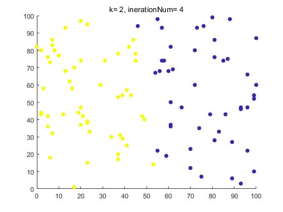
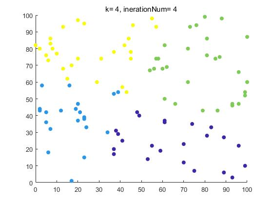

# 作业7  

## 要求  
在MapReduce上实现K-Means算法并在小数据集上测试。可以使用附件的数据集，也可以随机生成若干散点的二维数据（x, y)。设置不同的K值和迭代次数，可视化聚类结果。  
提交要求同作业5，附上可视化截图。  

## 实现思路  
我直接使用了实例代码来运行，用原来的代码创建maven项目KMeansExample。由于原来的代码不是用maven管理的，而且是基于Hadoop1.2编写的程序，所以有一些地方需要进行小小的修改。比如每个java文件前面都要加上对应的包名称，Job对象的创建需要调用getInstance静态方法，而不能直接new Job。  
我尝试研读了整个算法的代码，下面简要描述一下示例代码的思路。  

### 主程序：KMeansDriver.main()  
KMeansDriver.main()方法是整个算法的主程序，它从命令行接收指定的参数k（需要聚成的类数），iterationNum（迭代次数），inputpath，outputpath。依次调用三个主要的过程：  
generateInitialCluster()：随机产生k个cluster center  
clusterCenterJob()：迭代更新cluster center  
KMeansClusterJod()：最终计算各个点所属的类  
```java  
public static void main(String[] args) throws IOException, InterruptedException, ClassNotFoundException{
    System.out.println("start");
    Configuration conf = new Configuration();
    //命令行传入参数k,iterationNum,输入输出路径
    int k = Integer.parseInt(args[0]);
    int iterationNum = Integer.parseInt(args[1]);
    String sourcePath = args[2];
    String outputPath = args[3];
    KMeansDriver driver = new KMeansDriver(k, iterationNum, sourcePath, outputPath, conf);
    //随机生成k个cluster center
    driver.generateInitialCluster();
    System.out.println("initial cluster finished");
    //调用迭代的MapReduce过程，不断更新cluster center
    driver.clusterCenterJob();
    //迭代完成后，计算每个点所属的类
    driver.KMeansClusterJod();
}
```  

### 更新簇中心：KMeans  
在clusterCenterJob()方法中，通过循环提交KMeans job来实现cluster center的迭代更新。  
```java  
public void clusterCenterJob() throws IOException, InterruptedException, ClassNotFoundException{
    for(int i = 0;i < iterationNum; i++){
        Job clusterCenterJob = Job.getInstance(this.conf);
        ...
    }
}
```  
#### KMeansMapper  
KMeansMapper在setup方法中，读取上一次迭代/初始随机生成的cluster文件，生成k个Cluster类。
```java  
while((line = in.readLine()) != null){
    System.out.println("read a line:" + line);
    Cluster cluster = new Cluster(line);
    cluster.setNumOfPoints(0);
    kClusters.add(cluster);
}
```  
在mapper方法中，对于每个样本点，计算样本点离哪个cluster center最近，然后构造包含该点的cluster，类别就是所属的类。  
```java  
id = getNearest(instance);
if(id == -1)
    throw new InterruptedException("id == -1");
else{
    Cluster cluster = new Cluster(id, instance);
    cluster.setNumOfPoints(1);
    System.out.println("cluster that i emit is:" + cluster.toString());
    context.write(new IntWritable(id), cluster);
}
```  
#### KMeansCombiner和KMeansReducer  
KMeansCombiner对同类的cluster对象进行合并，将cluster center加权产生新的cluster center。  
KMeansReducer和Combiner做的事情相同，也是将同类cluster对象合并，最后输出的就是更新后的cluster，和对应的cluster center坐标。  
```java  
int numOfPoints = 0;
for(Cluster cluster : value){
    numOfPoints += cluster.getNumOfPoints();
    instance = instance.add(cluster.getCenter().multiply(cluster.getNumOfPoints()));
}
Cluster cluster = new Cluster(key.get(),instance.divide(numOfPoints));
cluster.setNumOfPoints(numOfPoints);
context.write(NullWritable.get(), cluster);
```  

### 计算每个点所属的类：KMeansCluster  
由于迭代过程生成的输出都是cluster center的信息，所以最后判断每个点属于哪一个类还需要做一次MapReduce。KMeansCluster中，只需要设计mapper方法，对每一个点计算离它最近的cluster center，对应的cluster id就是它的类别，reducer不需要做任何事，最后直接将点的坐标和cluster id输出即可。  
```java  
id = getNearest(instance);
if(id == -1)
    throw new InterruptedException("id == -1");
else{
    context.write(value, new IntWritable(id));
}
```  

## 运行和输出  
运行需要指定的参数有：k,iterationNum,输入路径,输出路径。格式为：  
hadoop jar [包名称] [KMeansDriver类名称] k iterationNum inputpath outputpath  
我的作业中，如果聚成3类，迭代次数为3，则命令为：  
hadoop jar KMeansExample-1.0-SNAPSHOT.jar com.hw7.KMeansDriver 3 3 KMeans/input KMeans/output  
最终聚类的结果在output\result1\clusteredInstances中。  

## 运行截图  
  
  
  
  
  

## 设置不同的k和迭代次数并可视化  
为了更加方便地设置不同k和iterationNum来运行。我直接写了一个脚本: generate_res.sh，脚本自动迭代不同的参数，然后将输出从hdfs中提取出来，保存为csv文件。  
```sh  
#开始迭代，从聚2个类开始
for((k=2;k<=$k_max;k++))
do
    for((n=3;n<=$iternum_max;n++))
    do
        hadoop jar KMeansExample-1.0-SNAPSHOT.jar com.hw7.KMeansDriver $k $n KMeans/input KMeans/output
        hdfs dfs -get KMeans/output/clusteredInstances/part-m-00000
        mv part-m-00000 $k"-"$n".csv"
        hdfs dfs -rm -r KMeans/output
    done
done
```  
最后生成的都是文件名为"k-iterationNum"的csv文件(文件放在了output/result2中)  
  
每个csv文件中，第一列和第二列是样本的两个维度，第三列是对应的类，用matlab画出分类的效果图即可。  
下面是一些例子：  
  
  
  
  
  
  
  
  
  
  